# Base2Tone-terminal

## Color schemes for the default Mac OS X Terminal

Base2Tone-terminal – colorschemes for the default Mac OS X Terminal ported from [Base2Tone iTerm2 color schemes](https://github.com/atelierbram/Base2Tone-iterm2) – one of the syntax-highlighting applications containing the colorschemes of [Base2Tone](http://base2t.one) which are based on [Duotone Themes](http://simurai.com/projects/2016/01/01/duotone-themes/) by [Simurai](http://simurai.com/) for Atom.

> “DuoTone themes use only 2 hues (7 shades in total). It __tones down__ less important parts (like punctuation and brackets) and highlights only the __important__ ones. This leads to a more calm color scheme, but still lets you find the stuff you're looking for.”

## Installation Instructions

- Clone or download this repo
- Go to `schemes/` folder
- Double click on selected `*.terminal` file. It will open a new Terminal window with that color scheme.
- Set the scheme as the default one with `Shell -> Use Settings as Default`

## Tools

### Convert iTerm 2 Color Scheme

This repo contains a [tool](https://github.com/lysyi3m/osx-terminal-themes) made by [Emil Kashkevich](https://github.com/lysyi3m) to convert any iTerm 2 color scheme into a Mac OS X Terminal scheme.

Convert by executing the swift script from the commandline:

```bash
$ ./tools/iterm2terminal.swift /path/to/my/awesome-scheme.itermcolors
```

### Generate Theme Preview

1. Load the theme in a terminal.
2. Run:

      ```bash
      $ tools/preview.sh
      ```

3. Set the font size to 14 (maybe set character spacing to 1, and line-height to 1,25).
4. Take a screenshot and put it in the `screenshots/` folder.
5. Update the `README.md` to include your new screenshot.


## Screenshots

### Base2Tone-EveningDark
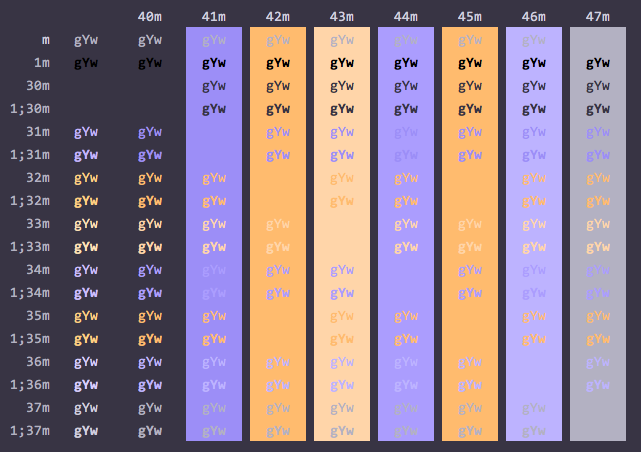

### Base2Tone-EveningLight
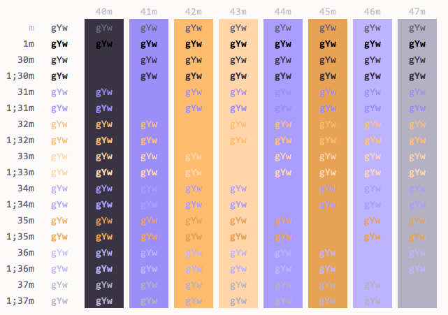

### Base2Tone-MorningDark
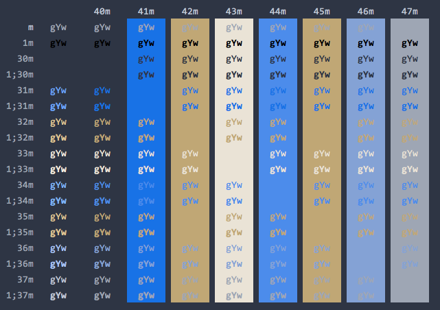

### Base2Tone-MorningLight
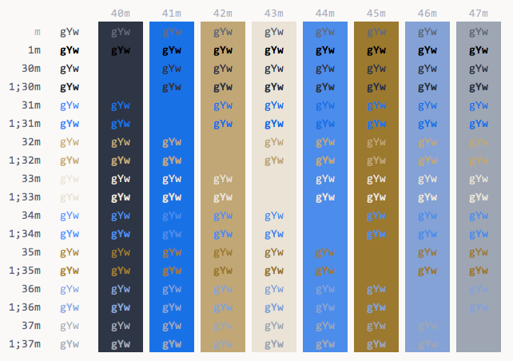

### Base2Tone-SeaDark
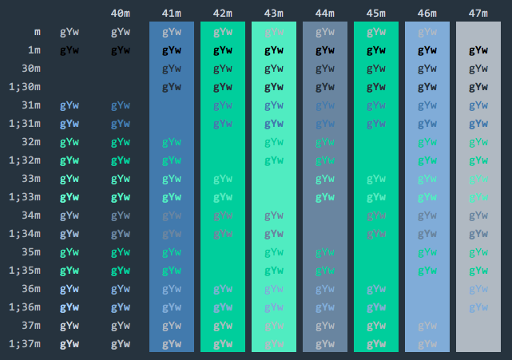

### Base2Tone-SeaLight
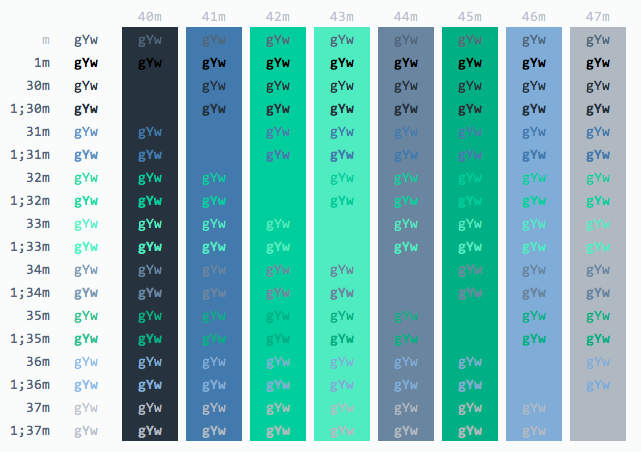

### Base2Tone-SpaceDark
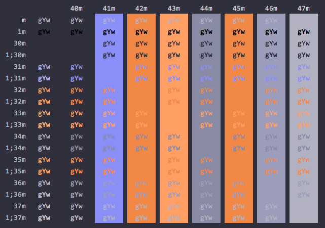

### Base2Tone-SpaceLight
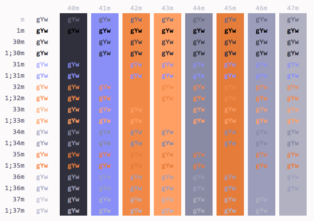

### Base2Tone-EarthDark
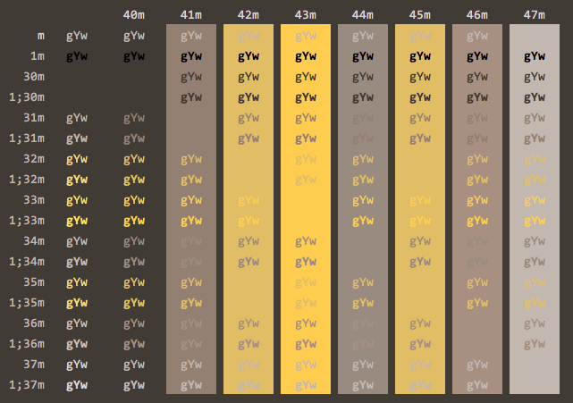

### Base2Tone-EarthLight
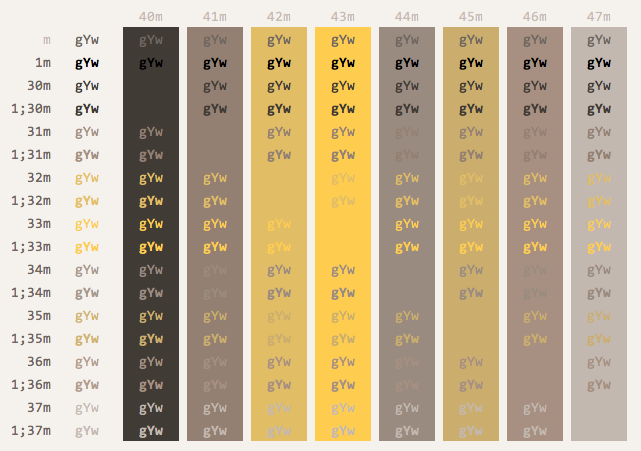

### Base2Tone-ForestDark
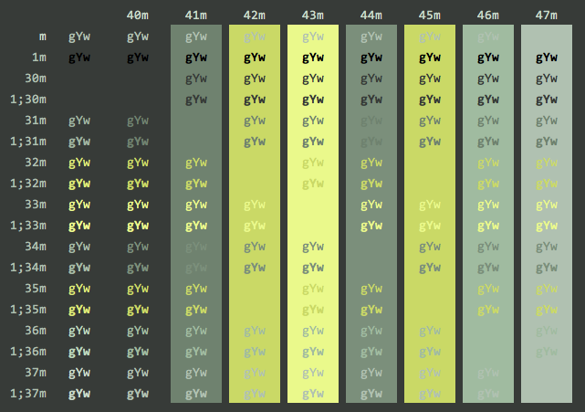

### Base2Tone-ForestLight
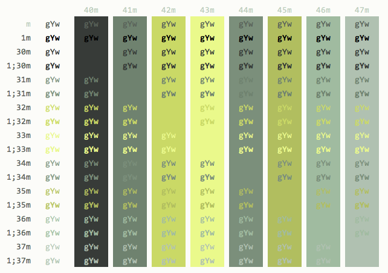

### Base2Tone-DesertDark
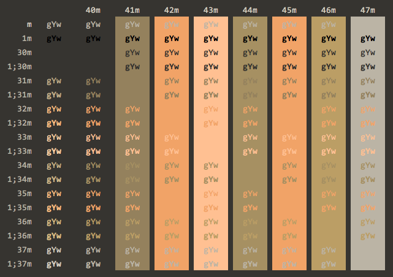

### Base2Tone-DesertLight
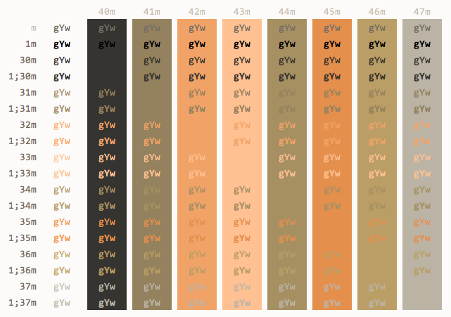

### Base2Tone-LakeDark
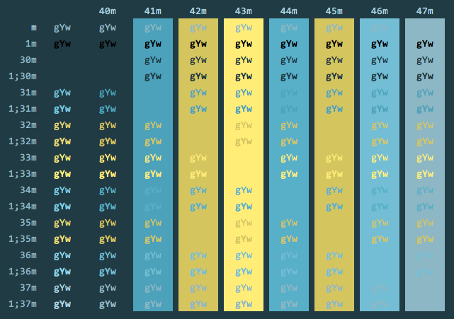

### Base2Tone-LakeLight
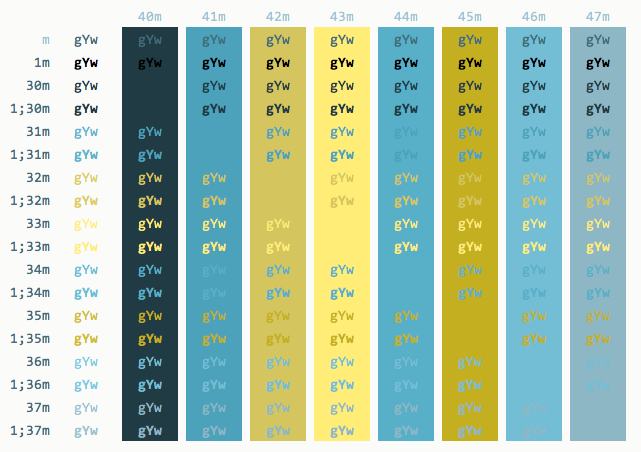

### Base2Tone-MeadowDark
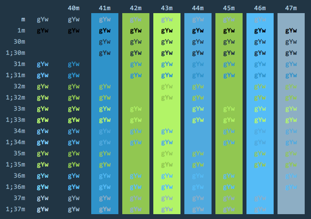

### Base2Tone-MeadowLight
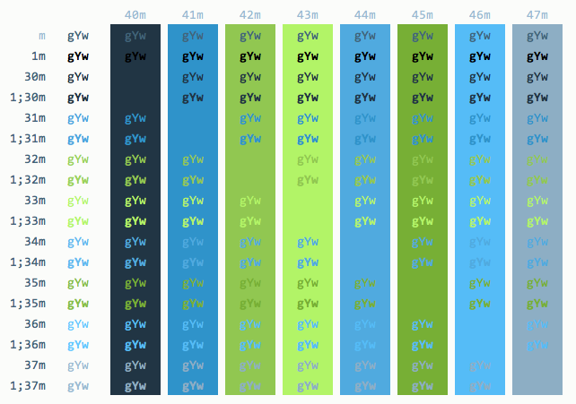

### Base2Tone-DrawbridgeDark
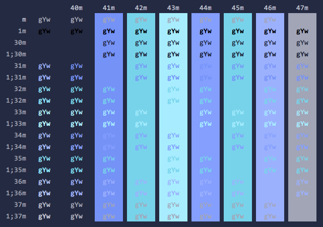

### Base2Tone-DrawbridgeLight
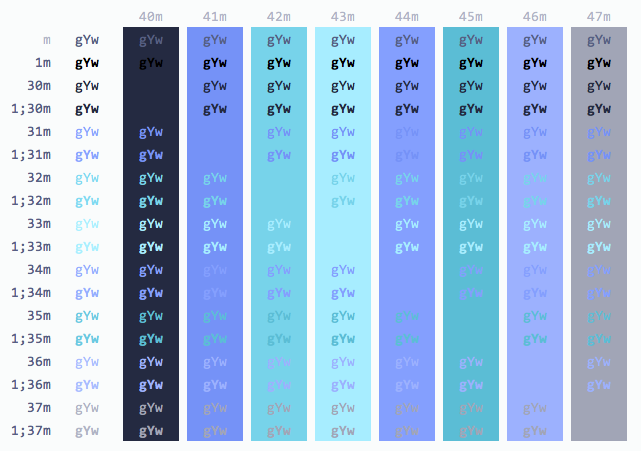

### Base2Tone-PoolDark
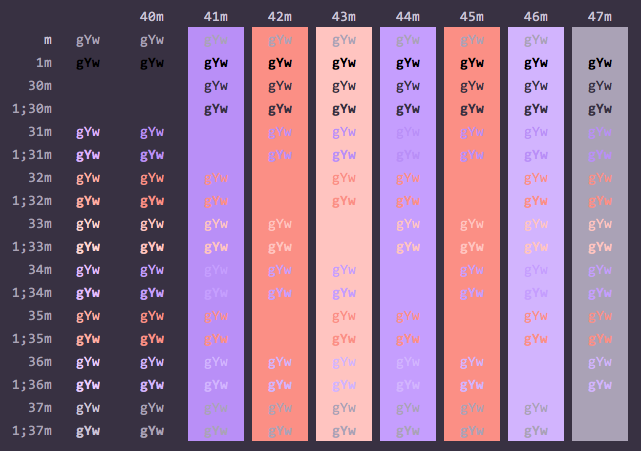

### Base2Tone-PoolLight
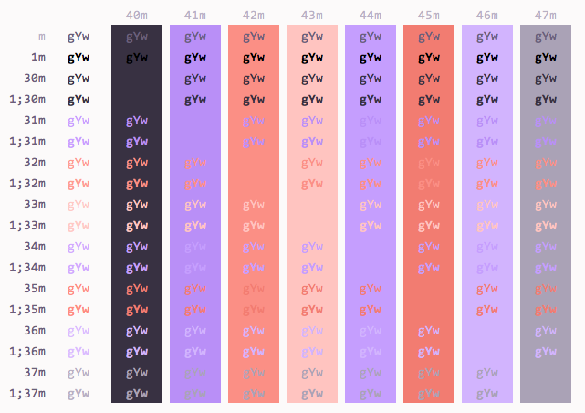

### Base2Tone-HeathDark
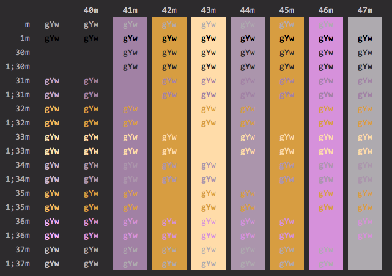

### Base2Tone-HeathLight
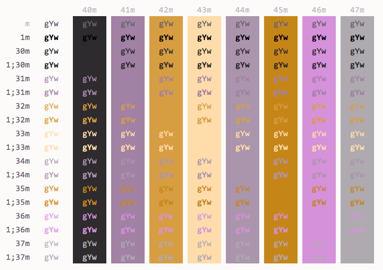

### Base2Tone-CaveDark
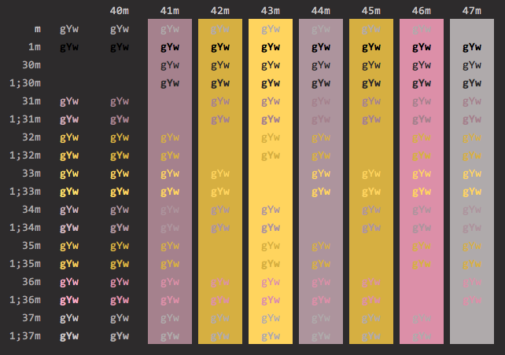

### Base2Tone-CaveLight
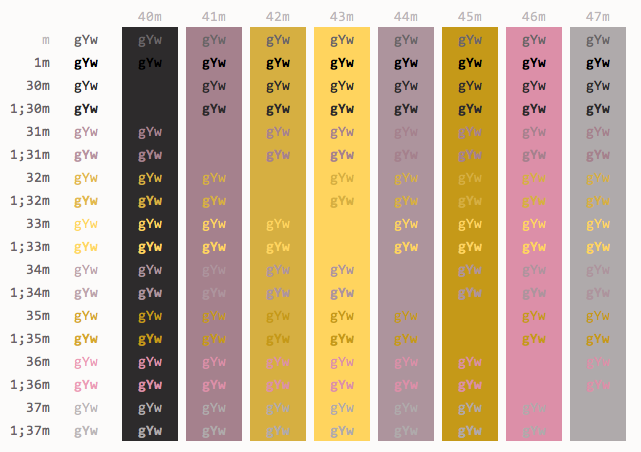

## Resources
- [Duotone Themes](http://simurai.com/projects/2016/01/01/duotone-themes/)
- [OSX Terminal Themes](https://github.com/lysyi3m/osx-terminal-themes)
- [iTerm2 Color Schemes](https://github.com/mbadolato/iTerm2-Color-Schemes)

## Credits
- [Simurai](http://simurai.com/)
- [Emil Kashkevich](https://github.com/lysyi3m)
- [Mark Badolato](https://github.com/mbadolato/)

### License
Copyright (c) 2018 [Bram de Haan](http://atelierbramdehaan.nl/)

Released under [MIT Licence](http://atelierbram.mit-license.org)

